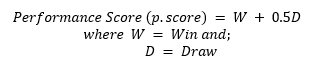
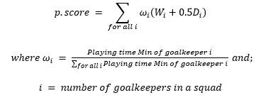

# Actuarial Theory and Practice A - Aim High

---

## Objectives 
 
    

It is beneficial for a nation's economy to have a successful international football team. 

A machine learning model is implemented for team selection.

In addition to the allocated budget, our proposal leverages alternate streams of non-government funding.

Revenues will be gained through matchday, broadcasting, sponsorship, merchandising, and prize money. 

The direct and indirect economic impacts were considered by analysing cash flows, effect on GDP, impact on industries and constructing a 10-year implementation plan. 

The proposal also considers quantifiable and qualitative risks, appropriate mitigation techniques and monitoring metrics. Limitations of the proposal are also included.

---

## Implementation plan
---
### Timeline:

### Monitoring Plan:

#### Team Performance Monitoring & Player Replacement Plan

The team committee will monitor the performance of players each season utilising the ML model to gauge players’ performance score. If a player appears to be under-performing during the season, the onus to encourage improvement lies with the coaching staff. Players that continue to underperform for two consecutive seasons despite improvement plans will have their contract renegotiated, or terminated.

### Key Metrics & Schedule:

#### Team Financials

| Name  | Calculation |	Purpose	| Acceptable Range | Frequency |
| ------------- | ------------- | ------------- | ------------- | ------------- |
| Operating Profit Margin  | Net CF from operations/ Operating revenue | Estimate op. profit compared to op. revenue | >10% in 2022-2025; >50% in 2026-2028; >65% in 2029-2031 | Quarterly |
| Net Profit Margin | Net CF/ Total revenue | Assess overall profit compared to overall revenue | >0% in 2023-2025; >40% in 2026-2028; >60% in 2029-2031 | Quarterly |
| Return on Player Salaries | Net CF from operations/ Total player salaries | Evaluate op. profit gained vs. player salaries paid out | >20% in 2022-2025; >100% in 2026-2028; >250% in 2029-2031 | Quarterly |

#### Economic Indicators

| Name | Calculation | Purpose | Acceptable Range | Frequency |
| ------------- | ------------- | ------------- | ------------- | ------------- |
| Direct GDP Impact Ratio | Team’s direct GDP impact/ National GDP | Estimate scale of impact of team on nation’s GDP | >0.1% in 2022-2028,>0.3% in 2029-2021, | Annually |
| Direct GDP Impact Growth | (GDP impact t/ GDP impact t-1) - 1 | Estimate change in GDP impact | >8% in 2023-2025;>20% in 2026-2031 | Annually |

---

## Selecting Rarita's National Team

---

We define a simple metric to measure the performance:

_Data is sourced from League Goalkeeping. League statistics are used as data quality is better than Tournament (38 games for all squads, less missing observations)_

To account for squads with multiple goalkeepers, the p.score is weighted by the proportion of minutes played for each GK. This gives:

The p.score is then mapped to all players in that squad. All players in the same squad will have the same p.score

The team selection process uses a Support Vector Machine classification model. This Machine Learning model is trained on League players (excluding Raritan) and classify if players are ‘competitive’ based on squad results.

_Note: We acknowledge that player selection will never be an exact science, and there are human elements that our quantitative model cannot account for (e.g. synergy, discipline etc.) Therefore, the coaching staff will apply their judgement in the selection of the final National roster from the ‘competitive’ player pool identified by our model._

* Likelihood of top 10 finish in FSA league within 5 years: 87.2%
* Likelihood of FSA championship within 10 years: 84.2%

See the players selected for the [Rarita National Team](Team%20selection.csv) here!

Explore the [code](teamselection.R) here!

---

## Analysis of Revenue & Expense

---

### Cash Flow Model

### Direct Revenue and Expenses
#### Operating Activities

This is the greatest contributor to the aggregate revenue’s exponential growth. Since the first few months are used for player selection and onboarding, matches will proceed from Q4 2022. As the team achieves more success, we expect uplift in matchday, broadcasting, and endorsement revenues. Staff costs will rise to support the rapid expansion of operations. Upon the completion of the stadium and training venue construction in 2026, cash previously deployed to service facility management expenses will now be used for new building maintenance.

#### Investing and Financing Activities
This investment strategy enables sustainable capital growth. With net proceeds re-invested and drawdowns allowed, the fund provides an equity pool that increased 65.7% from DOU500mn to DOU829mn over the 10 years. Net proceeds from the sale of stadium ownership and capital earned from taking profits of securities in 2028 and 2030 will have material impact in increasing the cash balance.

---

## Economic Impact 

---

| Economic Index  | Predicted Change (relative to Team Success) |
| ------------- | ------------- |
| GDP Growth Rate  | Increase - Operating revenues and initial budget granted by the government are taken as direct contributors to GDP. Against national GDP forecasts, the team will generate 0.80% of the nation’s GDP in 2031; a nominal increase of DOU3.4bn. A conservative estimate of the indirect economic impact is ~0.5%, primarily driven by tourism and tax revenues. |
| Employment Rate  | Increase - The project is expected to create 20,000 jobs across the National team, stadium construction and the increased demand for skilled labour involved in manufacturing, distribution and selling of merchandise. |
| Inflation Rate (CPI) | Neutral - Rarita’s inflation calculation is similar to that of the European Central Bank’s Harmonised Index of Consumer Prices. Referring to figure 9, ‘Recreation and Culture’ represents only 3.1% of the total, the team should not meaningfully affect inflation. |
| Consumer Spending  | Increase - Consumer spending is expected to rise alongside the popularity of recreational football. Ultimately, this will increase the quality of life enjoyed by Rarita citizens, drive the nation’s modernisation, and decrease social disparity among provinces. |
| FX (EURDOU) | Increase - With the assumption that Rarita is an emerging economy that will hike rates faster than the ECB, DOU appreciation is expected to reflect the change in interest rate differentials, along with improvement in trade balance and domestic growth. |

### Impact on Industries
As a result of the team’s success, the sports industry will be most directly and positively impacted. The stadium project will boost the construction industry. As Rarita improves its competitiveness on the international sports arena, the interest garnered will attract supporters to visit and watch their favourite players participate in live matches, thus benefiting local tourism and the hospitality sector.

### Social Impact on Provinces
Selection of the team’s base location plays an important role in shaping the future of different provinces and Rarita’s overall economy. Upon consideration of each region’s socioeconomic indicators, East Rarita emerges as the wealthiest province with a strong presence of multinational corporations and comparatively better living standards. Hence, in order to reduce economic inequality, the team will be based in West Rarita and allow this province to benefit significantly from Rarita’s overall growth strategy. Containing more than half of Rarita’s population, the marginal impact on West Rarita’s citizens will be greater, expanding employment opportunities and household income to create inter-generational wealth.

## Assumptions for Rarita's National Team Construction: 
---

####  Overview of Quantitative Assumptions 

 
####  Key Assumptions

| Assumptions  | Rationale |
| ------------- | ------------- |
| Performance Score Metric  | Individual performance metric of each other player will inform the actual future performance of the National team. |
| Investment Fund | Fund will follow manadate to  generate a minimum nominal return of 6.2% pa. |
| GDP growth | The expenditure approach is a well-suited method for future national GDP projections. |
| Inflation | Since the Central Bank adopted monetary easing as reflected in the rate cuts to zero in 2020, perhaps as a COVID-19 response, Rarita is likely experiencing a period of accelerating inflation. Hence, the model assumes the Central Bank targets an inflation band and returns to reach the 2% target from 2026 and onwards. |
| Interest rate | The 2021 Rarita nominal spot yield with a risk premium of 0.02% is used to account for the team's low default probability and high credit rating.| 

---

## Risks & Mitigation Approaches

---

All considered risks are captured in a Likelihood-Impact plane.

We see that Economic Recession is both high Impact and high Likelihood, and thus a key risk. Further investigation of this risk is conducted below:

#### Economic Recession

* Overview

	COVID-19 has had immense global economic impact and shifted broader policies of Central Banks. With most nations still recovering from lockdowns and international mobility restrictions in place, inflation has been at record-highs. Changes in the economic backdrop will affect project revenues and fund performance, thus decreasing free cash flow generated.

* Assessment

	We consider the three scenarios below. Future cash flows appear highly sensitive to revenue growth rates. This is further investigated through sensitivity analysis and we recommend a tolerable range of >-10% deviation of actual experience from projected growth. 

| Scenarios  | Assumptions |
| ------------- | ------------- |
| High Inflation  | 100bps increase in projected inflation  |
| Bearish Equity Market  | -30% investment returns in projection years 4 and 9  |
| Subdued Operating Revenue Growth | Annual growth from all revenue streams capped at 10% |

* Treatment

	Market risk is hedged through derivatives to minimise rate exposure and protect from sizable equity market crashes. Diversification in revenue sources and increase in the spectrum of marketable securities held will also alleviate this risk.
	
---

## Data and Data Limitation
---
### Missing Data
Missing player data was treated through removal of any player that had one or more missing observations from the player selection model. This approach was chosen for simplicity and we acknowledge that suitable players may have been unfairly disregarded. A more holistic approach could be to impute missing observations with machine learning methods. 

### Historical Results
The performance of players is dependent on several other factors, which include team synergy, game tactics, effectiveness of coaching and management. The provided “Player Data" is only a reflection of historical performance and does not guarantee the players’ ability to maintain results. 

### Lack of Economic Data
Important economic indicators, such as unemployment rate, balance of trade, domestic stock market as well as manufacturing and services PMI, are not given in the ‘Economic Data’. Hence, several assumptions are adopted on Rarita’s economy and provinces. There is also an absence of data on the key sectors that drive the nation’s GDP.

### Thank you for reading :) 
