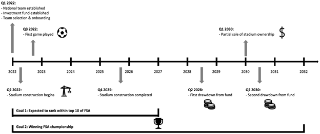
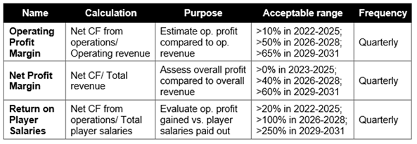
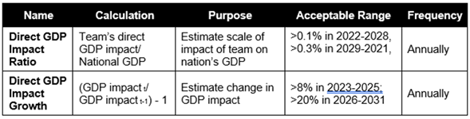
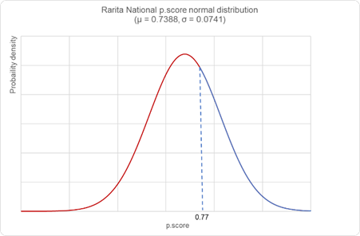
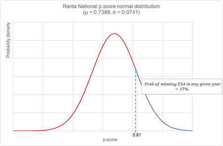
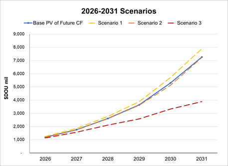
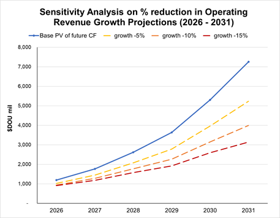

# Actuarial Theory and Practice A - Aim High

_"Tell me and I forget. Teach me and I remember. Involve me and I learn" - Benjamin Franklin_

---

### Congrats on completing the [2022 SOA Research Challenge](https://www.soa.org/research/opportunities/2022-student-research-case-study-challenge/)!

This is written in markdown language. 
>
* Click [4001 link](https://classroom.github.com/a/ggiq0YzO) to accept your group assignment.
* Click [5100 link](https://classroom.github.com/a/uVytCqDv) to accept your group assignment 

#### Follow the [guide doc](Doc1.pdf) to submit your work. 
---
>Be creative! Feel free to link to embed your [data](player_data_salaries_2020.csv), [code](sample-data-clean.ipynb), [image](ACC.png) here

More information on GitHub Pages can be found [here](https://pages.github.com/)

Ojectives of Analysis
 

-It is beneficial for a nation's economy to have a successful international football team. 
-A machine learning model is implemented for team selection 
-In addition to the allocated budget, our proposal leverages alternate streams of non-government funding.
-Revenues will be gained through matchday, broadcasting, sponsorship, merchandising, and prize money. 
 -The direct and indirect economic impacts were considered by analysing cash flows, effect on GDP, impact on industries and constructing a 10-year implementation plan. 
-The proposal also considers quantifiable and qualitative risks, appropriate mitigation techniques and monitoring metrics. Limitations of the proposal are also included.

## Implentation plan
---
### Timeline:

### Monitoring Plan:

Team performance monitoring and player replacement plan

The team committee will monitor the performance of players each season utilising the ML model to gauge players’ performance score. If a player appears to be under-performing during the season, the onus to encourage improvement lies with the coaching staff. Players that continue to underperform for two consecutive seasons despite improvement plans will have their contract renegotiated, or terminated.

### Key Metrics & Schedule:

#### Team Financials

#### Economic Indicators

## Selecting Rarita's National Team

---

We define a simple metric to measure the performance:

Performance Score (p.score) = W + 0.5D
where  W = Win and;
	D = Draw

_Data is sourced from League Goalkeeping. League statistics are used as data quality is better than Tournament (38 games for all squads, less missing observations)_

To account for squads with multiple goalkeepers, the p.score is weighted by the proportion of minutes played for each GK. This gives:

p.score = ∑_(for all i)▒〖ω_i (W_i+0.5D_i)〗
 where ω_i  =  (Playing time Min of goalkeeper i)/(∑_(for all i)▒〖Playing time Min of goalkeeper i〗)  and;

i = number of goalkeepers in a squad

The p.score is then mapped to all players in that squad. All players in the same squad will have the same p.score

The team selection process uses a Support Vector Machine classification model. This Machine Learning model is trained on League players (excluding Raritan) and classify if players are ‘competitive’ based on squad results.

_We acknowledge that player selection will never be an exact science, and there are human elements that our quantitative model cannot account for (e.g. synergy, discipline etc.) Therefore, the coaching staff will apply their judgement in the selection of the final National roster from the ‘competitive’ player pool identified by our model._

* Likelihood of top 10 finish in FSA league within 5 years: 87.2%
* Likelihood of FSA championship within 10 years: 84.2%

See the players selected for the [Rarita National Team](Team%20selection.csv) here!

Explore the [code](teamselection.R) here!

## Assumptions for the Rarita's national team construction: 

---

#### -> the general numerial assumptions listed below 

 
#### -> other key assumptions made for the entire process

---

## Risks and Mitigation Approaches

---

| Scenarios  | Assumptions |
| ------------- | ------------- |
| High inflation  | 100bps increase in projected inflation  |
| Bearish equity market  | -30% investment returns in projection years 4 and 9  |
| Subdued operating revenue growth | Annual growth from all revenue streams capped at 10% |

---

## Data and Data Limitation
---
### Missing Data

Missing player data was treated through removal of any player that had one or more missing observations from the player selection model. This approach was chosen for simplicity and we acknowledge that suitable players may have been unfairly disregarded. A more holistic approach could be to impute missing observations with machine learning methods. 

### Historical Results

The performance of players is dependent on several other factors, which include team synergy, game tactics, effectiveness of coaching and management. The provided “Player Data '' is only a reflection of historical performance and does not guarantee the players’ ability to maintain results. 

### Lack of Economic Data

Important economic indicators, such as unemployment rate, balance of trade, domestic stock market as well as manufacturing and services PMI, are not given in the ‘Economic Data’. Hence, several assumptions are adopted on Rarita’s economy and provinces. There is also an absence of data on the key sectors that drive the nation’s GDP.

